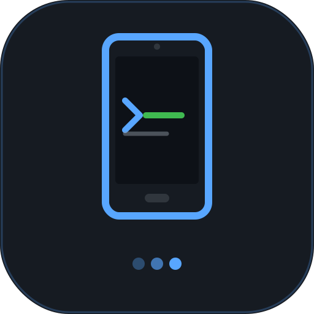
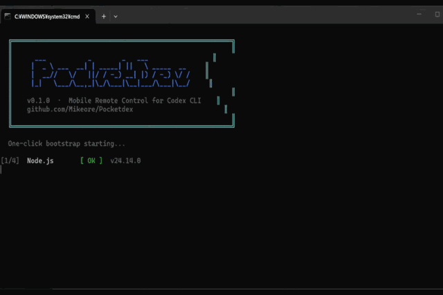
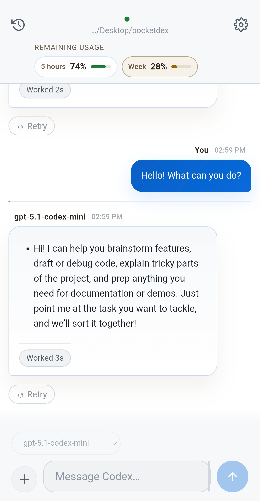
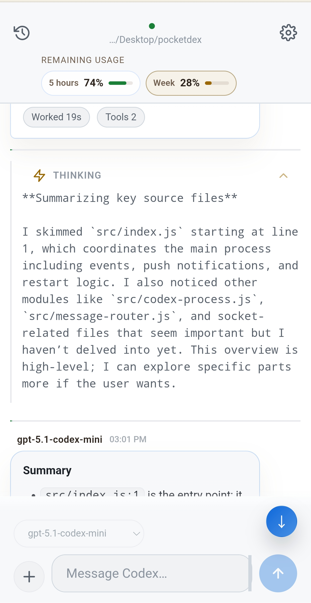
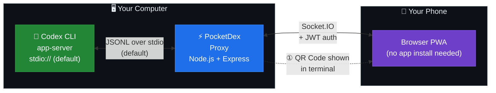
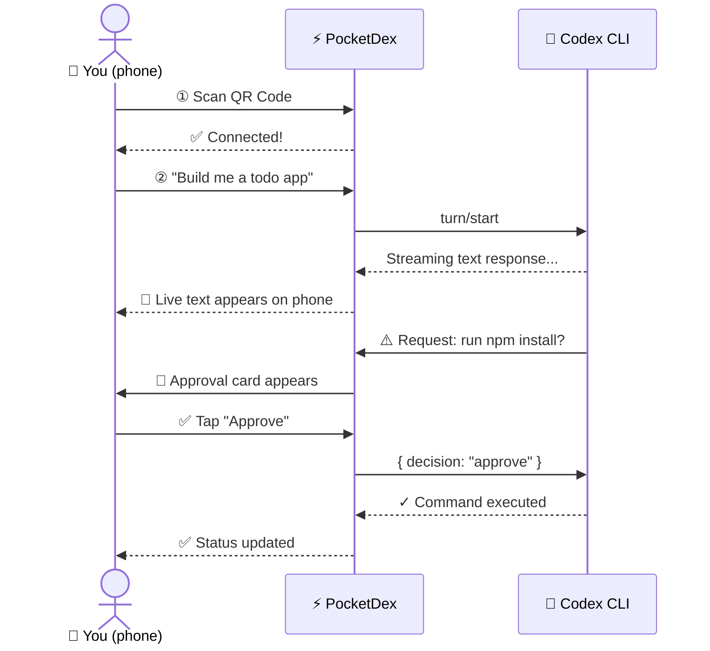
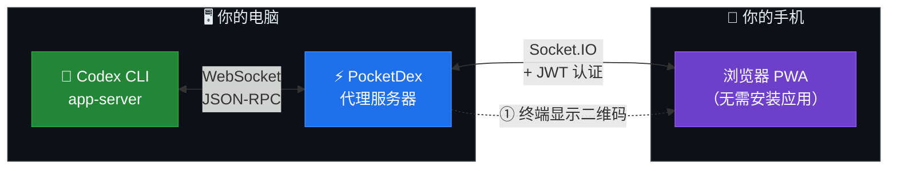
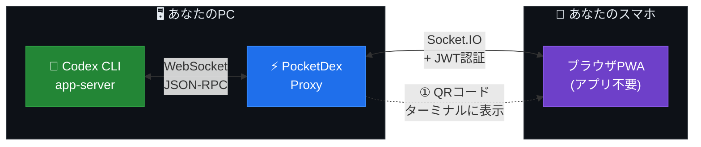

<!-- ═══════════════════════════════════════════════
     PocketDex README — https://github.com/Mikeore/PocketDex
     ═══════════════════════════════════════════════ -->
<div align="center">



# PocketDex

### Your Codex CLI — now in your pocket. 📱

**Scan a QR code. That's it.**
Your phone becomes a full remote control for your AI coding agent —
monitor progress, approve commands, and steer conversations from anywhere.

[](https://nodejs.org)
[](LICENSE)
[](https://web.dev/progressive-web-apps/)
[](https://github.com/Mikeore/PocketDex)
[](https://github.com/Mikeore/PocketDex/stargazers)

<br/>

**[English](#english)** · **[中文](#中文)** · **[日本語](#日本語)**

<br/>



<br/>
<br/>

<table>
  <tr>
    <td align="center">
      <br/>
      <sub>Chat</sub>
    </td>
    <td align="center">
      <br/>
      <sub>Thinking &amp; Response</sub>
    </td>
  </tr>
</table>

</div>

---

<h2 id="english">🇺🇸 English</h2>

## ⚡ Quick Start — Release ZIP Recommended

**Fastest path (no Git needed):**

1. Install **Node.js 18+** from [nodejs.org](https://nodejs.org)
2. Download the latest **PocketDex ZIP** from **GitHub Releases**
3. Unzip it anywhere
4. On Windows, double-click `start.bat`
5. On macOS / Linux, run `./start.sh`

> No Git? No terminal? That's fine. The ZIP release is the default path for normal users.
> If you are browsing the repo page and do not want to use Git, **Code → Download ZIP** also works for trying the current snapshot.

**Git clone is still fine for developers:**

**Windows**
```bat
git clone https://github.com/Mikeore/PocketDex.git && cd PocketDex && start.bat
```

**macOS / Linux**
```bash
git clone https://github.com/Mikeore/PocketDex.git && cd PocketDex && chmod +x start.sh && ./start.sh
```

```
✅  No global Codex install required
📦  First run installs PocketDex dependencies + a pinned local Codex CLI
🔐  If needed, the launcher opens `codex login` automatically
🛟  If browser login fails, it falls back to `codex login --device-auth`
📱  Scan the QR code that appears in your terminal
🎉  Done — your phone is now connected
```

> Normal users can just download the ZIP release and run the launcher. No manual `npm install`, no manual global `codex`, and no Git required.

### Maintainer release flow

```bash
npm run release:zip
```

This creates a GitHub Releases ZIP in `dist/` with production `node_modules` already bundled, so normal users can unzip and run `start.bat` / `start.sh` without a first-run dependency download.

If you want a clean source snapshot without bundled dependencies, use:

```bash
npm run repo:zip
```

---

## 🤔 What Is PocketDex?

Codex CLI is a powerful AI coding agent that lives in your terminal. But there's a catch:
**once you step away from your desk, you're blind.**

PocketDex fixes that.

| 😩 Without PocketDex | 😎 With PocketDex |
|---|---|
| 🖥️ Stuck at your desk | 📱 Monitor from your couch |
| ❓ Is it thinking or frozen? | ✅ Live real-time status |
| 🚫 Can't approve commands remotely | ✅ One-tap phone approvals |
| 📜 Raw terminal wall of text | ✅ Clean summarized cards |
| 🔔 Miss a critical approval request | ✅ Instant mobile notification |

---

## 🏗️ How It Works

```
   Your Computer                                    Your Phone
  ┌────────────────────────────────────┐           ┌─────────────────────┐
  │                                    │           │                     │
  │  ┌─────────────┐   stdio JSONL   │           │   📱 PWA Browser    │
  │  │  Codex CLI  │◄────────────────►│           │                     │
  │  │ app-server  │                  │  Socket.IO │  • Live chat view   │
  │  │ (local)     │  ┌────────────┐ │◄──────────►│  • Approval cards   │
  │  └─────────────┘  │ PocketDex  │ │  + JWT auth│  • File diffs       │
  │                    │   Proxy    │ │           │  • Model picker     │
  │                    │ (Node.js)  │ │           │                     │
  │                    └────────────┘ │           │  ① Scan QR to open  │
  └────────────────────────────────────┘           └─────────────────────┘
```



### Approval Flow — Step by Step



---

## ✨ Features

### Mobile UI

| Feature | What It Does |
|---|---|
| 📷 **QR Pairing** | Scan once — no IPs, no port numbers |
| ✅ **Live Approvals** | Approve / Deny / Allow-All with one tap |
| 💬 **Streaming Chat** | Watch Codex respond in real time |
| 🃏 **Status Cards** | Compact cards for commands, edits, tool calls |
| 🔍 **Drill Down** | Tap any card to expand full output or diffs |
| 🧠 **Reasoning View** | Collapsible thinking blocks (o1/o3 models) |
| ⚙️ **Model Picker** | Switch AI models from your phone |
| 🛑 **Stop / Resume** | Interrupt turns and restart remotely |
| 🏠 **Installable PWA** | Add to home screen on iPhone or Android |
| 🌐 **Multilingual** | English, 中文, 日本語 |

### Technical

| Component | Tech |
|---|---|
| Proxy Server | Node.js + Express + Socket.IO |
| Codex Bridge | stdio JSONL by default (`POCKETDEX_CODEX_TRANSPORT=ws` for debug fallback) |
| Auth | JWT one-time tokens |
| PWA Client | Vanilla HTML/CSS/JS (zero build step) |
| Offline Support | Service Worker shell caching |

---

## 📦 Full Install Guide

### Requirements

| Requirement | Version | Install |
|---|---|---|
| **Node.js** | 18 or later | [nodejs.org](https://nodejs.org) |
| **Codex auth** | ChatGPT or API-key capable Codex login | handled on first run by the launcher |
| **Network** | same WiFi as phone | — |

### Recommended: ZIP Release

1. Install **Node.js 18+** from [nodejs.org](https://nodejs.org)
2. Open **GitHub Releases** for this repo
3. Download the latest `PocketDex` ZIP
4. Unzip it
5. Run the launcher

**Windows**
- Double-click `start.bat`

**macOS / Linux**
```bash
chmod +x start.sh
./start.sh
```

**No Git installed?**

- Use the **Releases ZIP** if you want the cleanest normal-user path
- Or use **Code → Download ZIP** on GitHub if you just want the latest repo snapshot without Git
- You do **not** need to run `npm install` manually before the launcher

### Maintainer: build the Releases ZIP

```bash
npm run release:zip
```

That command creates a `dist/` ZIP with production `node_modules` already included. Upload that ZIP to GitHub Releases if you want users to avoid the first-run dependency install step.

For a repo-style ZIP without `node_modules`, run:

```bash
npm run repo:zip
```

### Developer path: Git clone

```bash
git clone https://github.com/Mikeore/PocketDex.git
cd PocketDex
```

Then run `start.bat` on Windows or `./start.sh` on macOS / Linux.

### What Happens on First Run

The launcher scripts will walk through this flow automatically:

```
• Check Node.js
• Install PocketDex dependencies
• Install the pinned local Codex CLI bundled in package.json
• Run `codex login` if needed
• Fall back to `codex login --device-auth` when browser login fails
• Launch PocketDex and print the QR code
```

---

### Advanced runtime toggle

PocketDex now prefers the more stable **stdio JSONL** transport when talking to Codex.
If you ever need the older WebSocket bridge for debugging, you can still opt in:

```bash
POCKETDEX_CODEX_TRANSPORT=ws npm start
```

## 🔐 Security

PocketDex is designed for **local network use only**.

- 🔑 The QR code contains a **short-lived JWT** (single-use, expires after first connection)
- 🔒 By default, Codex app-server stays on **local stdio only** — no internal port exposed at all
- 🧪 Optional WebSocket transport is available only when you explicitly set `POCKETDEX_CODEX_TRANSPORT=ws`
- 🛡️ The proxy **authenticates every Socket.IO connection**
- 🚫 No external network connections are opened by PocketDex itself (Codex still talks to the OpenAI API as usual)

> ⚠️ To expose outside your home network, put PocketDex behind HTTPS + a reverse proxy (nginx, Caddy, Traefik, etc.). Don't skip this.

---

## 📁 Project Structure

```
pocketdex/
├── client/               📱 Mobile PWA (no build step)
│   ├── index.html            App shell
│   ├── app.js                Main UI logic
│   ├── style.css             Dark-theme styles
│   └── sw.js                 Service Worker
├── src/                  ⚡ Proxy server
│   ├── index.js              Entry point
│   ├── codex-client.js       Codex WebSocket bridge
│   ├── message-router.js     Bidirectional message routing
│   ├── qr-auth.js            QR code + JWT generation
│   └── socket-server.js      Socket.IO server
├── shared/               🔗 Shared protocol helpers
├── docs/protocol/        📄 Codex JSON-RPC types (auto-generated)
├── scripts/bootstrap.js  🚀 Shared one-click bootstrap flow
├── start.bat             🪟 Windows one-click launcher
└── start.sh              🐧 macOS/Linux one-click launcher
```

See [docs/ARCHITECTURE.md](docs/ARCHITECTURE.md) for deep protocol and sequence diagrams.

---

## 🛠️ Development

```bash
npm install          # Install dependencies manually (dev workflow)
npm start            # Run the full one-click bootstrap + launch flow
npm run start:app    # Start the app directly (already installed/logged-in dev flow)
npm run dev          # Start with auto-restart (nodemon)
npm test             # Run test suite
```

---

## ❓ FAQ

**Q: Do I need to install an app on my phone?**
Nope. PocketDex is a Progressive Web App — runs directly in your phone's browser. Optionally add it to your home screen for a native-app feel.

**Q: Does it work on iPhone?**
Yes. iOS Safari and Android Chrome both work great.

**Q: The QR code doesn't scan / looks corrupted?**
Make sure your terminal supports UTF-8 and ANSI colors. On Windows, use Windows Terminal or PowerShell 7+.

**Q: My phone can't connect.**
Make sure both your PC and phone are on the **same WiFi network**.

**Q: Do I need Git or a global Codex install?**
No. For normal use, download the ZIP release and run the launcher. PocketDex installs its pinned local Codex dependency on first run.

**Q: Can I change the port?**
Yes — PocketDex reads the `POCKETDEX_PORT` environment variable.

- macOS / Linux: `POCKETDEX_PORT=8080 npm start`
- PowerShell: `$env:POCKETDEX_PORT=8080; npm start`
- Command Prompt: `set POCKETDEX_PORT=8080 && npm start`

Need to override the QR host or fix VPN / Docker / multi-network issues? Set `POCKETDEX_HOST` too:

- macOS / Linux: `POCKETDEX_HOST=192.168.1.23 npm start`
- PowerShell: `$env:POCKETDEX_HOST=192.168.1.23; npm start`
- Command Prompt: `set POCKETDEX_HOST=192.168.1.23 && npm start`

`.env` files are **not currently supported**.

**Q: Can I use this over the internet?**
You'd need HTTPS + a reverse proxy. Not recommended without extra hardening.

---

## 🤝 Contributing

1. Fork the repo
2. Create a feature branch: `git checkout -b feature/amazing-thing`
3. Commit and push
4. Open a Pull Request at [github.com/Mikeore/PocketDex](https://github.com/Mikeore/PocketDex)

---

## 📝 License

[MIT](LICENSE) — do whatever you want, just keep the attribution.

---

<h2 id="中文">🇨🇳 中文</h2>

## 什么是 PocketDex？

PocketDex 是 Codex CLI 的**手机端遥控器**。

打开电脑上的 PocketDex，用手机扫一下二维码，就能实时看到 Codex 在干什么——
是在思考、执行命令、还是等你审批——并且直接在手机上点同意或拒绝。

**不需要安装任何 App，手机浏览器直接用。**

## 一键启动（ZIP 发行包优先）

**最快的方式（不需要 Git）：**

1. 先从 [nodejs.org](https://nodejs.org) 安装 **Node.js 18+**
2. 去 **GitHub Releases** 下载最新的 PocketDex ZIP
3. 解压到任意位置
4. Windows 双击 `start.bat`
5. macOS / Linux 运行 `./start.sh`

> 不会用 Git、也不想先开终端也没关系。普通用户直接下载 ZIP 就行。
> 如果你正在 GitHub 仓库页面里，也可以直接点 **Code → Download ZIP** 试用当前快照。

```
✅ 不需要全局安装 Codex CLI
📦 首次运行会自动安装 PocketDex 依赖 + 固定版本的本地 Codex CLI
🔐 如有需要，启动器会自动打开 `codex login`
🛟 浏览器登录失败时，会自动切换到 `codex login --device-auth`
📱 扫描终端里的二维码即可连接
```

## 工作原理



## 主要功能

| 功能 | 说明 |
|---|---|
| 📷 **扫码连接** | 不用手输 IP 和端口，扫一下直接连 |
| ✅ **手机审批** | 一键同意 / 拒绝 / 全部允许 |
| 💬 **实时消息** | 流式显示 Codex 回复，实时滚动 |
| 🃏 **进度卡片** | 命令、文件修改、工具调用均有摘要卡片 |
| 🔍 **逐级展开** | 先看摘要，点一下看更多，再点看完整内容 |
| 🧠 **推理摘要** | 可展开/折叠模型的思考过程 |
| ⚙️ **模型切换** | 直接从手机切换 AI 模型 |
| 🛑 **中断/恢复** | 手机上随时停止或重启当前任务 |
| 🏠 **PWA 安装** | 可添加到 iOS/Android 主屏幕，像 App 一样用 |

## 一键启动（推荐 ZIP 发行包）

**推荐流程（不需要 Git）：**

1. 先从 [nodejs.org](https://nodejs.org) 安装 **Node.js 18+**
2. 在 **GitHub Releases** 下载最新的 PocketDex ZIP
3. 解压
4. Windows 双击 `start.bat`
5. macOS / Linux 运行 `./start.sh`

首次启动时会自动完成：

- 检查 Node.js
- 安装项目依赖
- 安装项目内置、固定版本的 Codex CLI
- 如未登录，自动进入 `codex login`
- 若浏览器登录失败，自动尝试 `codex login --device-auth`

## 系统要求

- Node.js 18+（[nodejs.org](https://nodejs.org)）
- 手机和电脑连接**同一个 WiFi 网络**

> 不需要提前全局安装 Codex CLI，也不需要先手动执行 `npm install`。

## 安全说明

- 二维码内含**一次性短效 Token**，用完即失效
- Codex app-server 仅监听 `127.0.0.1`，不对外暴露
- 每个 Socket.IO 连接均经过 JWT 认证

如需暴露到公网，请自行配置 HTTPS 与反向代理。

## 修改端口

PocketDex 读取的是 `POCKETDEX_PORT` 环境变量，而不是 `PORT`。

- macOS / Linux：`POCKETDEX_PORT=8080 npm start`
- PowerShell：`$env:POCKETDEX_PORT=8080; npm start`
- Windows CMD：`set POCKETDEX_PORT=8080 && npm start`

当前**不支持** `.env` 文件。

## 许可证

[MIT](LICENSE)

---

<h2 id="日本語">🇯🇵 日本語</h2>

## PocketDex とは？

PocketDex は、Codex CLI を**スマホからリモートで操作するためのUI**です。

PCで PocketDex を起動してQRコードをスキャンするだけで、
スマホのブラウザから Codex の動作をリアルタイムで確認・操作できます。

**アプリのインストール不要。スマートフォンのブラウザがそのまま使えます。**

## まずはこれ（ZIP版が最短）

**おすすめ手順（Git不要）**

1. [nodejs.org](https://nodejs.org) から **Node.js 18以上** をインストール
2. **GitHub Releases** から最新の PocketDex ZIP をダウンロード
3. 展開
4. Windows は `start.bat` をダブルクリック
5. macOS / Linux は `./start.sh` を実行

> Git が入ってなくても、ターミナルに慣れてなくても大丈夫。通常利用は ZIP 版が基本でOK。
> GitHub のリポジトリ画面から試したいだけなら、**Code → Download ZIP** でも最新版スナップショットを取得できます。

```
✅ グローバルの Codex CLI は不要
📦 初回起動で PocketDex 依存 + 固定版 Codex CLI を自動インストール
🔐 未ログインなら `codex login` を自動で開始
🛟 通常ログインが失敗したら `codex login --device-auth` に自動フォールバック
📱 ターミナルの QR コードをスマホで読むだけで接続完了
```

**開発者向けに Git clone も引き続き使える**

```bash
git clone https://github.com/Mikeore/PocketDex.git
cd PocketDex
```

その後、Windows は `start.bat`、macOS / Linux は `./start.sh` を実行。

### 配布者向け: Releases用ZIPを作る

```bash
npm run release:zip
```

これで `dist/` に、本番用 `node_modules` を同梱した GitHub Releases 向け ZIP が生成されます。これを Releases に上げれば、利用者側の初回依存インストールをかなり減らせます。

`node_modules` を含めない、リポジトリ配布向けのソースZIPが欲しいときはこっち:

```bash
npm run repo:zip
```

## 仕組み（図解）



## できること

| 機能 | 内容 |
|---|---|
| 📷 **QRコード接続** | IPアドレス入力なし、スキャン1回で接続 |
| ✅ **モバイル承認** | コマンド・ファイル変更をワンタップで承認/拒否 |
| 💬 **ストリーミング表示** | Codexの返答をリアルタイムで確認 |
| 🃏 **進捗カード** | コマンド・ツール呼び出し・コード変更をコンパクト表示 |
| 🔍 **段階的な詳細** | タップで要約→フル内容へ展開 |
| 🧠 **推論サマリ** | o1/o3系モデルの思考過程を折りたたみ表示 |
| ⚙️ **モデル切り替え** | スマホから使用するAIモデルを変更 |
| 🛑 **割り込み/再開** | 進行中のターンをスマホから停止・再開 |
| 🏠 **PWA対応** | ホーム画面に追加してアプリ感覚で利用可能 |

## 使い方

```
1️⃣  PC で start.bat (Windows) または ./start.sh を実行
2️⃣  ターミナルに表示されるQRコードをスマホで読み取る
3️⃣  スマホのブラウザが開いて接続完了 🎉
4️⃣  Codexが承認を求めたら、スマホの承認ボタンをタップ
```

## 必要なもの

- Node.js 18以上（[nodejs.org](https://nodejs.org)）
- スマホとPCが**同じWi-Fiネットワーク**に接続中

> 事前のグローバル Codex インストールは不要。通常利用なら ZIP を落として起動するだけでOK。

## セキュリティ

- QRコードには短命の**使い切りJWTトークン**が含まれます
- Codex app-server は `127.0.0.1`（ローカルのみ）にバインドされます
- Proxy 側ですべての Socket.IO 接続を認証します

外部ネットワークから接続する場合は、HTTPSとリバースプロキシを設定してください。

## ポート変更

PocketDex が読む環境変数は `PORT` ではなく `POCKETDEX_PORT` です。

- macOS / Linux: `POCKETDEX_PORT=8080 npm start`
- PowerShell: `$env:POCKETDEX_PORT=8080; npm start`
- Windows CMD: `set POCKETDEX_PORT=8080 && npm start`

現状 `.env` ファイルには対応していません。

## ライセンス

[MIT](LICENSE)
